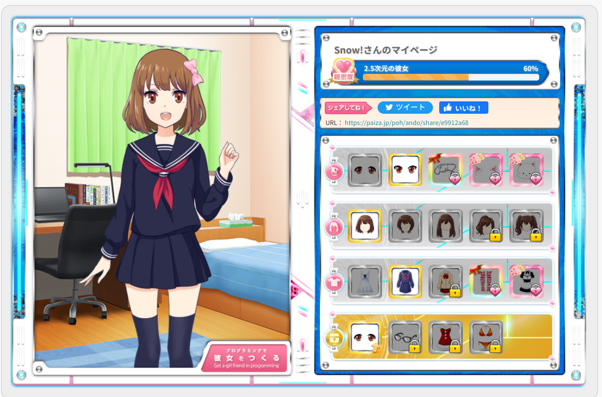

# paiza

## coding girl

## 恋するハッカソン 

## 髪(hair)    
- [ショートヘア](./src/r.py)
- [ロングヘア](./src/long.pyTall)
## プログラミングで彼女を作る. 

## 目(eyes)

- [つり目](./src/tsurime.py)

## 髪(hair)

- [ショートヘア](./src/shorthair.py)

- [ロングヘア](./src/longhair.py)
